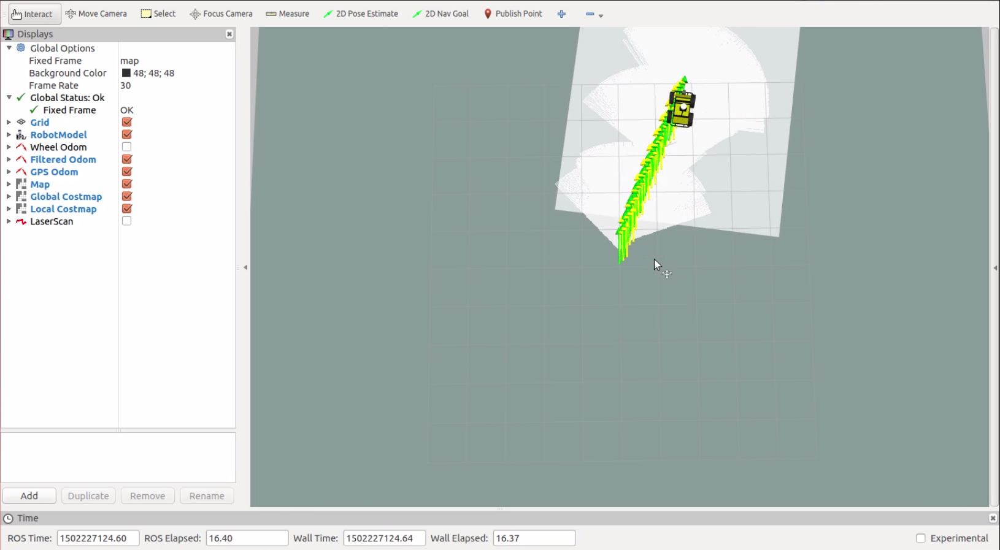

Husky Outdoor GPS Waypoint Navigation
=====================================   

This tutorial demonstrates how to use the `waypoint_nav <https://github.com/nickcharron/waypoint_nav>`_ package to perform autonomous GPS waypoint navigation on an outdoor Husky and in simulation. It requires a GPS, IMU and a front facing lidar.

This package uses a combination of the following packages:
	- ekf_localization to fuse odometry data with IMU and GPS data
	- navsat_transform to convert GPS data to odometry and to convert latitude and longitude points to the robot's odometry coordinate system
	- GMapping to create a map and detect obstacles
	- move_base to navigate to the goals while avoiding obstacles (goals are set using recorded or inputted waypoints)

The outdoor_waypoint_nav package within waypoint_nav includes the following custom nodes:
	- gps_waypoint to read the waypoint file, convert waypoints to points in the map frame and then send the goals to move_base
	- gps_waypoint_continuous1 and gps_waypoint_continuous2 for continuous navigation between waypoints using two seperate controllers
	- collect_gps_waypoint to allow the user to drive the robot around and collect their own waypoints
	- calibrate_heading to set the heading of the robot at startup and fix issues with poor magnetometer data
	- plot_gps_waypoints to save raw data from the GPS for plotting purposes
	- gps_waypoint_mapping to combine waypoint navigation with Mandala Robotics' 3D mapping software for autonomous 3D mapping

Installing Software
-------------------

1. Visit the `waypoing_nav <https://github.com/nickcharron/waypoint_nav>`_ Github Repo and select **copy link** or **download zip**

2. Clone repo or unzip folder to your ~/catkin_ws/src/ directory (or to the source folder of your catkin workspace)

3. Ensure you have all necessary packages:

 .. code:: bash

	$ sudo apt-get install ros-indigo-gazebo-*

 .. code:: bash

	$ sudo apt-get install ros-indigo-husky-*

 .. code:: bash

	$ sudo apt-get install ros-indigo-robot-localization 

 .. code:: bash

	$ sudo apt-get install ros-indigo-move-base

4. Compile:

 .. code:: bash

	$ cd ~/catkin_ws/

 .. code:: bash

	$ catkin_make

Understanding the Software
--------------------------

There are two components to the waypoint navigation that you need to run. The first launch file (outdoor_waypoint_nav_sim.launch) launches the simulation, teleop, rviz as well as your localization, mapping and controller packages. This will not make the robot move but it will continue to update its estimated state and maps.

Let's discuss what each package is doing:

	**robot_localization** is used to fuse all your sensor data using two separate ekf_localization nodes. One ekf node, named ekf_se_odom, is used to filter all the continuous data, i.e. IMU and wheel odometry. The second ekf node, named ekf_se_map, is used to fuse discrete data (GPS) along with other sources of data. Furthermore, the navsat_transform node is used to convert the raw GPS data into odometry messages that can then inputted into the ekf, while also publishing the transform from the UTM coordinate frame to the robot's odometry frame. The ekf_se_odom node publishes the TF transform from odom frame to the base_link frame (this needs to be continuous) whereas the ekf_se_map publishes the TF transform from the map frame to the odom frame. Since the latter is discrete due to the discrete measurements coming from your GPS, your robot's estimated state will jump around slightly when it is visualized in RVIZ. Visit `robot_localization <http://docs.ros.org/lunar/api/robot_localization/html/index.html>`_ for additional information.  

	**GMapping** is used to create the map that will be used for navigation. It should be noted that the transform from the map frame to the odom frame from GMapping is not used. We cannot have two nodes publishing the same transform, therefore we want to use the transform from the ekf node not from GMapping. For more information, see the `GMapping ROS Wiki <http://wiki.ros.org/gmapping>`_ , or `GMapping Documentation <http://openslam.org/gmapping.html>`_	

The second component that needs to be launched is the joystick launch controller (joy_launch_control.launch). You will need to plug in a controller for this simulation to work. The joy_launch_control node subscribes to messages from the joystick and controls what nodes are launched and shut down. Launching this node will also not make your robot move until you start to press buttons on the joystick. 

There are 4 launch files that can be launched, shutdown and re-launched using the joystick:

	1. **safety_node.launch**: remaps velocity commands outputted from move_base to the correct topic name for the husky velocity controller. This allows the user to safely stop the robot motion at any time by killing this node.
	2. **heading_calibration.launch**: drives the husky forward a given distance and rate and calculates the heading error at startup. The robot will then return to its initial location and write the heading offset to the navsat params file.
	3. **collect_goals.launch**: allows the user to drive the Husky around while collecting gps waypoints. It saves these waypoints (as latitude and longitude coordates) to a text file that can be saved and played back.
	4. **send_goals.launch**: reads the gps coordinates from a text file, converts those coordinates to move_base goals and publishes them. The text file that is read can be the file that was created with the collect_goals node, or the text file can be created manually by retrieving gps coordinates from another source.

Running the Simulation
----------------------

First launch the localization, mapping and planning nodes:

.. code:: bash

	$ roslaunch outdoor_waypoint_nav outdoor_waypoint_nav_sim.launch

You should have two displays that appear, Gazebo and RVIZ:

Before running the joystick launch controller, please configure your launch file for your specific controller. Using your favourite editor, open:

.. code:: bash

	~/catkin_ws/src/wapoint_nav/outdoor_waypoint_nav/launch/simulation/joy_launch_control_sim.launch

Edit the arguments to set your joystick buttons to what you want. You may need to launch the teleop joystick package to view which buttons are mapped to which number. These arguments are set by default to work with a Logitech F710 joystick (in x mode). 

Launch the joystick controller:

.. code:: bash

	$ roslaunch outdoor_waypoint_nav  joy_launch_control_sim.launch 

On your screen, it will remind you what buttons need to be selected to perform each task:

.. image:: HuskyGPSWaypointNav_joy_launch_control.png
 
You can now drive your Husky around to collect waypoints, and then follow those same waypoints that were just collected.

**Simulation Results**

The following `video <http://embed.vidyard.com/share/1EGdVBFCLbB5Dqh1n7GvdE?>`_ shows the results of running the simulation as described above:

.. raw:: html

        <object width="576" height="462"><param name="movie"
        value="https://play.vidyard.com/1EGdVBFCLbB5Dqh1n7GvdE.html?v=3.1.1"></param><param
        name="allowFullScreen" value="true"></param><param
        name="allowscriptaccess" value="always"></param><embed
        src="https://play.vidyard.com/1EGdVBFCLbB5Dqh1n7GvdE.html?v=3.1.1"
	allowscriptaccess="always"
        allowfullscreen="true" width="576"
        height="462" style="padding: 0px 0px 20px 0px;"></embed></object>

Building and Configuring your Husky
-----------------------------------

Based on the type of GPS and IMU you are using, you may have to change several files. Once your sensors have been mounted to your Husky, measure their location and orientation with respect to the base_link coordinate frame. Update the URDF with these new measurements. The URDF can be found at:

.. code:: bash

	/waypoint_nav/husky_customization/husky_custom_description/urdf/custom_description.urdf.xacro

For help editing the URDF, refer to the `ROS URDF Tutorials <http://wiki.ros.org/urdf/Tutorials>`_
. You can find a sketch showing the dimensions of the Husky `here <https://www.clearpathrobotics.com/husky-unmanned-ground-vehicle-robot/>`_ . The base_link coordinate frame is located in the middle of the bottom plate.

**Important Note:** since robot_state_publisher already publishes a transform to your imu_link based on the environmental variables describing the IMU pose, the easiest way to set the pose of your IMU is by changing the environmental variables. For simplicity, we use a bash script that will export the appropriate environmental variables each time you start your navigation. Based on your measurements, edit the bash script located at:

.. code:: bash

	/waypoint_nav/outdoor_waypoint_nav/run.sh 

Next, you will need to edit the launch files that bring up your sensor drivers. Navigate to the following directory:

.. code:: bash

	/waypoint_nav/outdoor_waypoint_nav/launch/include

Edit the **imu.launch**, **gps.launch** and **laser.launch** files to bringup the appropriate drivers. The default is configured to work with a UM6 IMU, NovAtel SMART6-L GPS and Sick LMS111 laser scanner. Be sure they are publishing to the correct topics, and set the appropriate IP address for your laser.

Performing GPS Waypoint Navigation on your Husky
------------------------------------------------

If all your sensors are publishing to the same topics as the default simulation from waypoint_nav, and your frame IDs are set the same, then launching outdoor_waypoint_nav.launch should start up your eks nodes, navsat node, and move_base properly. Make sure your GPS is outdoor and unobstructed before launching so that it can get a fix, otherwise the navsat node will not initialize properly.

On your robot computer, launch the localization, mapping and planning nodes **using your bash script** (do not just launch the file directly using roslaunch):

.. code:: bash

	$ ./run.sh

Next, in another terminal run the joy_launch_control node:

.. code:: bash

	$ roslaunch outdoor_waypoint_nav  joy_launch_control.launch 

To run the calibration node, first close all your nodes and relaunch. Make sure your Husky has at least 5m of space in front of it for calibration. You can edit the distance and speed that the robot drives by changing the x_vel and x_vel_time parameters. Those can be set in your terminal when running the launch file, or it can be changed by editing the heading_calibration.launch file.

On the joystick, press the button that starts calibration (START button by default). You should see:

Your robot will move forward the specified distance, and then return to its initial location while writing the heading calibration to the navsat params file. Your screen output should be similar to:

You will need to restart the ekf nodes to load the new heading parameters. You may need to repeat this calibration multiple times until you are happy with the heading alignment shown in RVIZ. It is recommended to repeat this procedure every time you start your robot with a new heading. Alternatively, you can manually set the start position (refer to `robot_localization docs <http://docs.ros.org/lunar/api/robot_localization/html/integrating_gps.html#required-inputs>`_ )

You are now ready to collect waypoints or follow waypoints. The collect_gps_waypoint node will save the collected waypoints to the same text file that the gps_waypoint node will read from. This file can be manually changed if you want to input your own gps coordinates. This coordinates file is located at:

.. code:: bash

	/waypoint_nav/outdoor_waypoint_nav/waypoint_files/points_outdoor.txt

and for simulation:

.. code:: bash

	/waypoint_nav/outdoor_waypoint_nav/waypoint_files/points_sim.txt	

To start waypoint collection, press the start collection button (LB by default). You can then drive around collecting waypoints along your path. Make sure to end the node with the joystick, then launch the waypoint following node (RB button by default).

The following video <http://embed.vidyard.com/share/mS1S2t6kEQZ3YkY4bPAuyc?>`_ illustrates an implementation of this software on one of our own Husky's:

.. raw:: html

        <object width="576" height="462"><param name="movie"
        value="https://play.vidyard.com/mS1S2t6kEQZ3YkY4bPAuyc.html?v=3.1.1"></param><param
        name="allowFullScreen" value="true"></param><param
        name="allowscriptaccess" value="always"></param><embed
        src="https://play.vidyard.com/mS1S2t6kEQZ3YkY4bPAuyc.html?v=3.1.1"
	allowscriptaccess="always"
        allowfullscreen="true" width="576"
        height="462" style="padding: 0px 0px 20px 0px;"></embed></object>

Continuous GPS Waypoint Navigation
----------------------------------

We have also developed separate software that allows you to navigate between each waypoint without stopping. This has all be integrated into the `waypoint_nav repo <https://github.com/nickcharron/waypoint_nav>`_.

This software works by using two separate move_base nodes (named controller_1 and controller_2) that run simultaneously. The waypoints are fed to the controllers such that each controller gets every other waypoint. Say the robot is currently navigating to goal 3 with controller 1. When the robot approaches the goal, it tells controller 2 that it should start planning its route to goal 4. Once controller 2 has planned its route and starts publishing its velocity commands, the switch_controller node detects these commands and switches the control from controller 1 to controller 2 and then cancels the goal that was given to controller 1. Controller 1 then waits for the signal from controller 2 to start planning to the next goal, and so on. 

The parameter **goalTolerance** controls how close the robot needs to be to its goal to send a start signal to the next controller. You can edit this parameter in the send_goals_continuous.launch file located at:

.. code:: bash

	/waypoint_nav/outdoor_waypoint_nav/launch/include

We have provided an outdoor_waypoint_nav_continuous.launch file and a joy_launch_controller_continuous.launch file as well as the equivalent launch files for simulation. Simply start those launch files instead of the ones specified above, and you're done. Remember that if you are running the software on your real Husky, use the bash sript to launch the main launch file. In this case, use the run_continuous.sh script.

The following video <http://embed.vidyard.com/share/1EGdVBFCLbB5Dqh1n7GvdE?>`_ illustrates the continuous waypoint following in action:

.. raw:: html

        <object width="576" height="462"><param name="movie"
        value="https://play.vidyard.com/1EGdVBFCLbB5Dqh1n7GvdE.html?v=3.1.1"></param><param
        name="allowFullScreen" value="true"></param><param
        name="allowscriptaccess" value="always"></param><embed
        src="https://play.vidyard.com/1EGdVBFCLbB5Dqh1n7GvdE.html?v=3.1.1"
	allowscriptaccess="always"
        allowfullscreen="true" width="576"
        height="462" style="padding: 0px 0px 20px 0px;"></embed></object>

Common Problems
---------------

1. Husky base not launching
	- These packages have all been built assuming that you already have husky_base running when you power on your robot. If this is not the case, you will either need to launch husky_base on your own, or uncomment the lines in the main launch files that include the husky_base launch file.

2. Unable to reach goal 
	- Reason 1: Often you will notice that you robot stops moving in the middle of navigation. A common reason for this is if you are in rough terrain and your laser hits the ground and interprets it as an obstacle. This can occur even in relatively flat grass. Confirm this is the reason by launch rviz and visualizing the global and local costmaps.
	- Solution: filter your laser measurements to a lesser maximum usable range. This can be done with a laser filter nodelet (see laser.launch) or by changing your parameters in the GMapping launch file. 
	- Reason 2: Other times, your robot might not move at all when it is given to a new goal. This is usually the case when the goal is set to a location that cannot be reached according to your global planner. If the goal is in a location outside of the global costmap, or somewhere wihthin an obstacle, then your global planner will be unable to plan a route.
	- Solution: If your goal is outside your global costmap, increase the costmap size by edditing:

		.. code:: bash

			/waypoint_nav/husky_navigation/params/global_costmap_params.yaml

		If your goal is within an obstacle, either change your goal or change the default_tolerance parameter and move_base will get as close as it can to the goal.

3. Robot moving too slow
	- The velocity can be changed within your move_base params. Edit:
	
		.. code:: bash

			/waypoint_nav/husky_navigation/params/base_local_planner_params.yaml

	- Do not set the min_vel_x lower than 0.1. Sending velocity commands that are very low will not result in enough voltage going to the motors to actually overcome the friction of the tires. Therefore move_base will get "stuck".
 
4. Unable to navigate around obstacles
	- There are many parameters that you can tune with the move_base planner. You may need to adjust these if your robot is not properly planning routes around obstacles. This planning is done in the local planner.
	- Edit the base_local_planner_params file. See the comments in the yaml file for a description of these parameters.
	- Common parameters to tune: vx_samples, vtheta_samples, controller_frequency
	- It also might be helpful to tune the costmap parameters such as the inflation_radius and cost_scaling_factor found in:

		.. code:: bash

			/waypoint_nav/husky_navigation/params/costmap_common_params.yaml

5. Robot continually rotating about its goal
	- Sometimes the Husky will continue to try to adjust its position to get to the exact goal location.
	- Solution: increase the xy_goal_tolerance and/or yaw_goal_tolerance in base_local_planner.yaml

6. Improper Initialization:
	- The navsat_transform_node takes care of creating the transform from the world frame to the odom frame. It does this using absolute position data at start-up. In our case, it uses the x and y pose from the GPS and the Yaw from the IMU's magnetometer. Since these measurements are noisy and biased, often this will cause error in the transform that is used for the whole navigation of your robot. 
	- This is a known issue with navsat_transform. For now, we recommend restarting all your nodes when really poor initialization occurs. We are currently working on a solution that determines the start point of your robot by filtering your data over a given distance. Please have a look at the READ_ME file in the github repository for notes on when that has been fixed and how to use the new feature.

7. Localization Accuracy:
	- You may notice that when navigating to waypoints that you have collected, your robot might not end up within the distance tolerance that you have set for the goal, whereas in simulation this will likely not be an issue.
	- Reason: Extended Kalman Filters (EKFs) such as the ones used in this package, assume that measurements are Gaussian with a zero mean noise. In Gazebo, the GPS data is simulated using a zero mean Gaussian distribution, so the EKF will perform really well. However, GPS signals are neither Gaussian nor do they have noise with zero mean. Therefore you should expect to see more error in your outdoor navigation compared to your simulated navigation
	- If you would like to visualise the data from your GPS and compare that to the simulated data, a node named plot_gps_waypoints has been created in the outdoor_waypoint_nav package that allows you to collect and store raw GPS data for plotting purposes.
	- The following two images show the GPS data from simulation compared to the data collected using a NovAtel SMART6-L. Both datasets show 700 points taken at 0.1 Hz. The covariances for simulation were set in Gazebo to be equal to the calculated covariances from the Novatel GPS data. 

          

Note: The Novatel GPS discretizes its own data which explains the grid pattern that is seen in the above image. To visualize the quantity of data points at each location, the size of the points has been scaled according to the quantity of data points per location.

The following image shows data collected at the same rate using a Garmin GPS18x-5Hz:

Waypoint Mapping with Mandala-Mapping
-------------------------------------

For those with the 3D Mapping kit from `Mandala-Robotics <http://mandalarobotics.com/>`_ , we have also provided a node and launch files to perform waypoint navigation and mapping simultaneously. To add this to your robot:

1. Visit the `Mandala-Mapping repo <https://github.com/nickcharron/mandala-mapping>`_ and copy link

2. Clone to your workspace and build:

	.. code:: bash

		$ cd ~/catkin_ws/src

	.. code:: bash

		$ git clone <paste link>
   
	.. code:: bash

		$ cd ~/catkin_ws

	.. code:: bash

		$ catkin_make	

3. In one terminal, run the waypoint navigation

	.. code:: bash

		$ cd ~/catkin_ws/src/waypoint_nav/outdoor_waypoint_nav/

	.. code:: bash

		$ ./run.sh

4. In another terminal, run the joystick launch controller (specific launch file for mapping)

	.. code:: bash

		$ roslaunch outdoor_waypoint_nav joy_launch_control_mapping.launch

5. In a third terminal, run the mapping:

	.. code:: bash
	
		$ roslaunch m3d_husky_launch m3d_husky_bringup.launch

6. Follow the instructions in the joy_launch_control_mapping terminal. 

Your Husky will automatically collect a scan at each waypoint that it reaches, so take this into consideration when setting your waypoints. We recommend moving no more than 3 meters between scans to ensure successful scan matching. Scanmatching results will also depend on your environment and the range of your lasers. If your 3D map does not appear to be built accurately enough, you may need a better rotating lidar or an environment with more features. You can also increase the density of the 3D map by moving in smaller increments between your scans. For more information, take a look at the `mapping blog post <https://www.clearpathrobotics.com/2017/07/rapid-outdoorindoor-3d-mapping-husky-ugv/>`_.

The following `video <http://embed.vidyard.com/share/5sMjrx8sUmNMaHwyj7yFwc?>`_ shows the autonomous GPS waypoing mapping in action to map the Clearpath parking lot and part of the building:

.. raw:: html

        <object width="576" height="462"><param name="movie"
        value="https://play.vidyard.com/5sMjrx8sUmNMaHwyj7yFwc.html?v=3.1.1"></param><param
        name="allowFullScreen" value="true"></param><param
        name="allowscriptaccess" value="always"></param><embed
        src="https://play.vidyard.com/5sMjrx8sUmNMaHwyj7yFwc.html?v=3.1.1"
	allowscriptaccess="always"
        allowfullscreen="true" width="576"
        height="462" style="padding: 0px 0px 20px 0px;"></embed></object>

